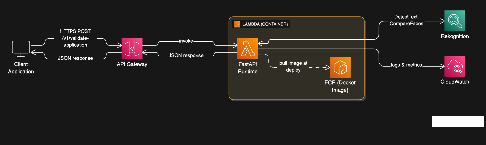
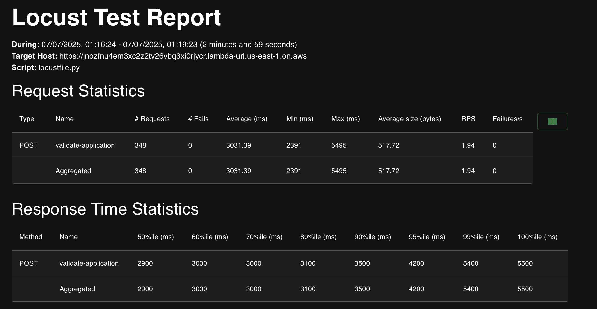

# Form Validator API

A FastAPI-based application for validating PDF form applications using AWS Rekognition for facial recognition and document processing. The API validates application forms by comparing face images within the document and checking text consistency.

## Architecture



## Features

- PDF document validation with 3-page requirement
- Facial recognition using AWS Rekognition
- Text similarity validation using fuzzy matching
- Asynchronous processing for better performance
- Docker containerization for easy deployment

## Prerequisites

- Python 3.10+
- Docker
- AWS CLI
- AWS Account with appropriate permissions

## Local Development

### 1. Clone and Setup

```bash
git clone https://github.com/jvishwa06/hv-formvalidation.git
cd hvformvalidation
```

### 2. Install Dependencies

```bash
pip install -r requirements.txt
```

### 3. Run Locally

```bash
uvicorn main:app --reload --host 0.0.0.0 --port 8000
```

The API will be available at `http://localhost:8000`

### 4. Test Local API

```bash
curl -X POST http://localhost:8000/v1/validate-application \
  -F "file=@sample3.pdf"
```

### 5. API Documentation

Visit `http://localhost:8000/docs` for interactive API documentation.

## Cloud Deployment

### 1. AWS Setup

1. **Login to AWS Console**
2. **Create IAM User** with the following policies:
   - `AmazonRekognitionFullAccess`
   - `AWSLambdaExecute`
   - `AmazonEC2ContainerRegistryFullAccess`
3. **Generate Access Key and Secret Key** for the IAM user
4. **Configure AWS CLI:**
   ```bash
   aws configure
   ```

   Enter your AWS Access Key ID, Secret Access Key, and preferred region (us-east-1).

### 2. Push Docker Image to AWS ECR

1. **Make deploy script executable:**
   ```bash
   chmod +x deploy.sh
   ```

2. **Run deployment script:**
   ```bash
   ./deploy.sh
   ```

   This script will:
   - Create ECR repository
   - Build Docker image for linux/amd64 platform
   - Push image to ECR
   - Output the image URI for Lambda function creation

### 3. Create Lambda Function

1. **Go to AWS Lambda Console**
2. **Create Function:**
   - Choose "Container image"
   - Function name: `form-validator-api`
   - Container image URI: (use the URI from deploy.sh output)
   - Architecture: x86_64
3. **Configure Function:**
   - Timeout: 10 seconds
   - Memory: 512 MB (minimum recommended)
4. **Enable Function URL:**
   - Go to Configuration → Function URL
   - Create function URL
   - Auth type: NONE
   - CORS: Enable if needed for web applications

### 4. Test Deployed API

```bash
curl -X POST https://your-function-url.lambda-url.us-east-1.on.aws/prod/v1/validate-application \
  -F "file=@sample3.pdf"
```

## Load Testing

### Prerequisites

Install Locust for load testing:

```bash
pip install locust
```

### 1. Local Load Testing

```bash
uvicorn main:app --host 0.0.0.0 --port 8000

locust -f locustfile.py --host=http://localhost:8000
```

### 2. Cloud Load Testing

```bash
locust -f locustfile.py --host=https://your-function-url.lambda-url.us-east-1.on.aws
```

### 3. Load Test Configuration

- **Web UI:** Open `http://localhost:8089`
- **Users:** Start with 10-50 concurrent users
- **Spawn Rate:** 5 users per second
- **Test Duration:** 5-10 minutes for initial testing

### 4. Command Line Load Testing

```bash
locust -f locustfile.py --host=https://your-function-url.lambda-url.us-east-1.on.aws \
  --users 50 --spawn-rate 5 --run-time 5m --headless
```

### 5. Load Test Metrics

Monitor the following metrics:
- **Response Time:** Should be < 5 seconds for PDF processing
- **Success Rate:** Should be > 95%
- **Throughput:** Requests per second
- **Error Rate:** Monitor for timeout and memory errors

### 6. Load Test Results



## API Endpoints

### POST /v1/validate-application

Validates a PDF application form.

**Request:**
- Content-Type: `multipart/form-data`
- Body: PDF file (max 10MB)

**Response:**
```json
{
  "is_valid": true,
  "confidence_score": 0.85,
  "validation_details": {
    "page_count": 3,
    "face_match_confidence": 0.92,
    "name_consistency": true,
    "processing_time": 2.34
  }
}
```

## Configuration

### Environment Variables

- `AWS_REGION`: AWS region (default: us-east-1)
- `MAX_FILE_SIZE_MB`: Maximum file size in MB (default: 10)
- `TEXT_SIMILARITY_THRESHOLD`: Text similarity threshold (default: 80)
- `FACE_SIMILARITY_THRESHOLD`: Face similarity threshold (default: 0.7)

## Troubleshooting

### Common Issues

1. **AWS Credentials Error:**
   - Ensure AWS CLI is configured correctly
   - Verify IAM user has required permissions

2. **Docker Build Issues:**
   - Ensure Docker is running
   - Check platform compatibility (linux/amd64)

3. **PDF Processing Errors:**
   - Ensure PDF has exactly 3 pages
   - Check file size (max 10MB)
   - Verify PDF contains readable text and images

### Logs and Monitoring

- **Local:** Check console output
- **Lambda:** Monitor CloudWatch logs
- **Load Testing:** Review Locust web interface metrics