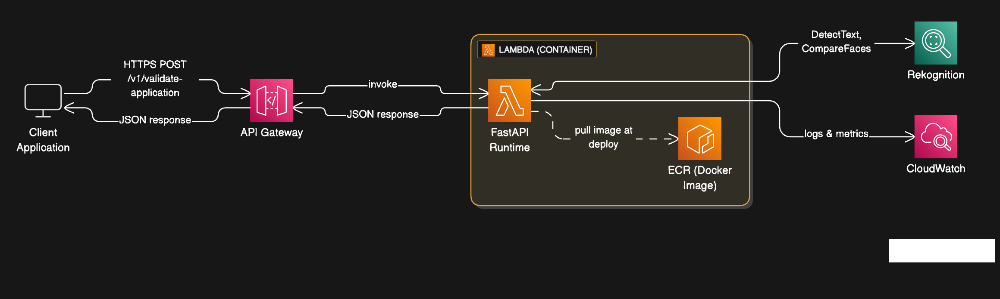
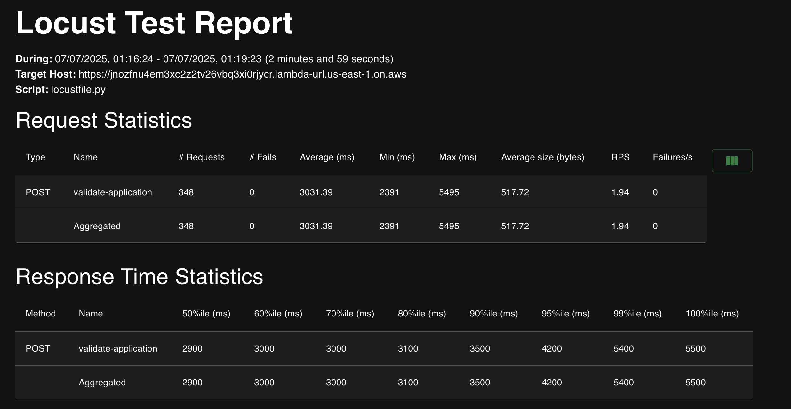

# Account Opening Form Verification API

A FastAPI-based application that validates customer onboarding application forms using AWS Rekognition for face comparison and document OCR. It performs two primary validations:
Data-to-Document Match – Validates that typed form fields match the printed data on the PAN card image.
Face-to-Face Match – Verifies that the face on the PAN card matches the selfie image.

## Architecture



## Features

- PDF document validation with 3-page requirement
- Facial recognition using AWS Rekognition
- Text similarity validation using fuzzy matching
- Asynchronous processing for better performance
- Docker containerization for easy deployment

## Tech Stack

- **AWS Rekognition** - OCR and face comparison services
- **RapidFuzz** - Fast string matching for name consistency validation
- **PyMuPDF** - PDF document processing and manipulation
- **FastAPI** - High-performance web framework for building APIs
- **Docker** - Containerization for consistent deployment
- **AWS ECR** - Docker container registry for image storage and management
- **AWS Lambda** - Serverless compute platform
- **AWS CloudWatch** - Logging and monitoring services

## Experimentation and Technology Choices

### 1. Initial OCR and Face Recognition Testing

**Technology Evaluation: EasyOCR vs pytesseract + facenet vs face_recognition library**
- **OCR Comparison:** 
  - EasyOCR: Higher latency compared to pytesseract
  - pytesseract: Achieved ~1.5 second latency for text extraction (chosen for better performance)
- **Face Recognition Comparison:**
  - facenet: Higher latency compared to face_recognition library
  - face_recognition library: Provided <1 second latency for face matching (chosen for better performance)
- **Major Issue:** face_recognition library was difficult to setup due to heavy C++ compilation requirements in Linux environments, making deployment challenging

### 2. Handling Rotated and Skewed Documents

**Challenge:** pytesseract and Haar cascade for face detection struggled with rotated and skewed PAN card images

**Initial Approach - OpenCV Contours:**
- Attempted to use OpenCV contours for ID card detection
- **Issues:** Did not work reliably across different surfaces and backgrounds, required separate threshold adjustments for each scenario

**Final Solution for OCR:**
- Trained a custom YOLO model for ID card detection 
- Detected, cropped, and rotated the ID card before feeding to pytesseract for accurate text extraction
- **Limitation:** Could not accurately determine the correct rotation angle for optimal text orientation

**Solution for Face Detection:** Replaced Haar cascade with YOLO-FaceV11 model for better face detection in unclear, skewed, and rotated images (latency: <80ms)

### 3. AWS Rekognition Adoption

**After extensive exploration, migrated to AWS Rekognition for both OCR and face comparison:**
- **Performance:** Low latency for both text extraction and face comparison
- **Robustness:** Handles rotated texts and faces effectively
- **Quality:** Works well with low-quality images
- **Cost-Effective:** Low per-request pricing model
- **Reliability:** Managed service with high availability

### 4. Deployment Strategy Evolution

**From EC2 to AWS Lambda:**
- **EC2 Limitations:** Inefficient and costly when instances are idle
- **Lambda Benefits:**
  - Serverless compute - runs only on user requests
  - Creates new instances for each user request
  - Instances live only for the execution duration
  - Pay-per-use pricing model (charged only for actual running time)
  - Automatic scaling and management

## Prerequisites

- Python 3.10+
- Docker
- AWS CLI
- AWS Account with appropriate permissions

## Local Development

### 1. Clone and Setup

```bash
git clone https://github.com/jvishwa06/hv-formvalidation.git
cd hvformvalidation
```

### 2. Install Dependencies

```bash
pip install -r requirements.txt
```

### 3. Run Locally

```bash
uvicorn main:app --reload --host 0.0.0.0 --port 8000
```

The API will be available at `http://localhost:8000`

### 4. Test Local API

```bash
curl -X POST http://localhost:8000/v1/validate-application \
  -F "file=@sample3.pdf"
```

### 5. API Documentation

Visit `http://localhost:8000/docs` for interactive API documentation.

## Cloud Deployment

### 1. AWS Setup

1. **Login to AWS Console**
2. **Create IAM User** with the following policies:
   - `AmazonRekognitionFullAccess`
   - `AWSLambdaExecute`
   - `AmazonEC2ContainerRegistryFullAccess`
3. **Generate Access Key and Secret Key** for the IAM user
4. **Configure AWS CLI:**
   ```bash
   aws configure
   ```

   Enter your AWS Access Key ID, Secret Access Key, and preferred region (us-east-1).

### 2. Push Docker Image to AWS ECR

1. **Make deploy script executable:**
   ```bash
   chmod +x deploy.sh
   ```

2. **Run deployment script:**
   ```bash
   ./deploy.sh
   ```

   This script will:
   - Create ECR repository
   - Build Docker image for linux/amd64 platform
   - Push image to ECR
   - Output the image URI for Lambda function creation

### 3. Create Lambda Function

1. **Go to AWS Lambda Console**
2. **Create Function:**
   - Choose "Container image"
   - Function name: `form-validator-api`
   - Container image URI: (use the URI from deploy.sh output)
   - Architecture: x86_64
3. **Configure Function:**
   - Timeout: 10 seconds
   - Memory: 128
4. **Enable Function URL:**
   - Go to Configuration → Function URL
   - Create function URL
   - Auth type: NONE
   - CORS: Enable if needed for web applications

### 4. Test Deployed API

```bash
curl -X POST https://your-function-url.lambda-url.us-east-1.on.aws/prod/v1/validate-application \
  -F "file=@sample3.pdf"
```

## Load Testing

### Prerequisites

Install Locust for load testing:

```bash
pip install locust
```

### 1. Local Load Testing

```bash
uvicorn main:app --host 0.0.0.0 --port 8000

locust -f locustfile.py --host=http://localhost:8000
```

### 2. Cloud Load Testing

```bash
locust -f locustfile.py --host=https://your-function-url.lambda-url.us-east-1.on.aws
```

### 3. Load Test Configuration

- **Web UI:** Open `http://localhost:8089`
- **Users:** Start with 10-50 concurrent users
- **Spawn Rate:** 5 users per second
- **Test Duration:** 5-10 minutes for initial testing

### 4. Command Line Load Testing

```bash
locust -f locustfile.py --host=https://your-function-url.lambda-url.us-east-1.on.aws \
  --users 50 --spawn-rate 5 --run-time 5m --headless
```

### 5. Load Test Metrics

Monitor the following metrics:
- **Response Time:** Should be < 5 seconds for PDF processing
- **Success Rate:** Should be > 95%
- **Throughput:** Requests per second

### 6. Load Test Results for 10 Concurrent Users



## API Endpoints

### POST /v1/validate-application

Validates a PDF application form.

**Request:**
- Content-Type: `multipart/form-data`
- Body: PDF file (max 10MB)

**Response:**
```json
{
  "is_valid": true,
  "confidence_score": 0.85,
  "validation_details": {
    "page_count": 3,
    "face_match_confidence": 0.92,
    "name_consistency": true,
    "processing_time": 2.34
  }
}
```

## Configuration

### Environment Variables

- `AWS_REGION`: AWS region (default: us-east-1)
- `MAX_FILE_SIZE_MB`: Maximum file size in MB (default: 10)
- `TEXT_SIMILARITY_THRESHOLD`: Text similarity threshold (default: 80)
- `FACE_SIMILARITY_THRESHOLD`: Face similarity threshold (default: 0.7)

## Troubleshooting

### Common Issues

1. **AWS Credentials Error:**
   - Ensure AWS CLI is configured correctly
   - Verify IAM user has required permissions

2. **Docker Build Issues:**
   - Ensure Docker is running
   - Check platform compatibility (linux/amd64)

3. **PDF Processing Errors:**
   - Ensure PDF has exactly 3 pages
   - Check file size (max 10MB)
   - Verify PDF contains readable text and images

### Logs and Monitoring

- **Local:** Check console output
- **Lambda:** Monitor CloudWatch logs
- **Load Testing:** Review Locust web interface metrics